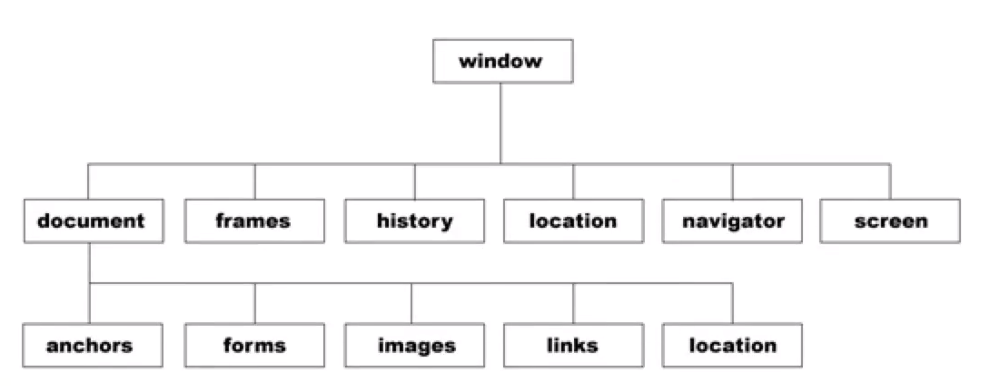
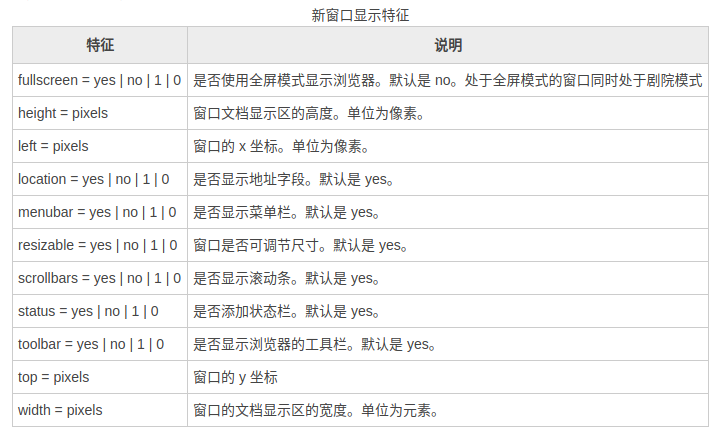

# BOM

## BOM 简介

BOM： 浏览器对象模型 (browser object modle)

一个窗口就代表了一个浏览器对象



## window 下面的 系统对话框

alert confirm prompt ： 他们都是window的方法

- alert ：弹出警告框
- confirm ：弹出一个取消和确认按钮的对话框(他具有返回值，用户点击确认，返回 ```true``` 用户点击取消，返回 ```false```)
- prompt ：弹出一个具有输入框的对话框，它里面可以传入两个参数，第一个是提示的内容，第二个是输入框中的默认的内容(如果不传就是空);注意：他也具有返回值和确认和取消按钮；(当用户点击确认时，返回的值是输入的内容【字符串】,当用户点击的是取消的时候，返回的是null)

```javascript
let res = confirm("你确定要退课吗？");
console.log(res);
```

```js
let res = window.prompt("please input yoour name");
console.log(res);
```

## open 方法

open方法也是window下的方法

open方法有三个参数：

- 第一个：是要打开窗口的url
- 第二个：是给打开的窗口命名，并是在该名字的窗口上打开新的页面
- 第三个：是一串特殊的字符串

第三个参数：

